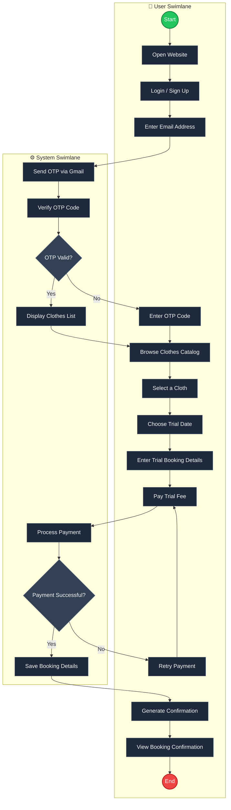

# Try-Fit (Online Clothes Trial Booking System)

## System Activity Diagram

The diagram below maps out the end-to-end workflow between the **User** and the **System**, including email-based OTP verification, catalog browsing, and trial booking payment processing.

---

## Process Breakdown

### 1. Authentication & Security Flow
1. **User**: Opens the website and clicks **Login / Sign Up**.
2. **User**: Submits their registered **Email Address**.
3. **System**: Generates a 6-digit OTP and dispatches it via Gmail SMTP (`polakash918@gmail.com`).
4. **System**: Verifies the submitted OTP code.
   - **Invalid**: System prompts the user to re-enter the code.
   - **Valid**: System authorizes the user session and renders the clothes catalog.

### 2. Clothing Selection & Trial Booking
1. **User**: Browses the available clothing collection (Men, Women, Sarees, Kurtis, Shoes, etc.).
2. **User**: Selects a garment and chooses an available trial date.
3. **User**: Enters trial delivery address and booking details.
4. **User**: Submits trial fee payment.

### 3. Payment & Booking Confirmation
1. **System**: Processes the transaction via payment gateway.
   - **Payment Failed**: Returns user to the payment retry step.
   - **Payment Successful**: Saves trial booking records in the MySQL database and generates booking confirmation receipt.
2. **User**: Views booking confirmation on dashboard.
